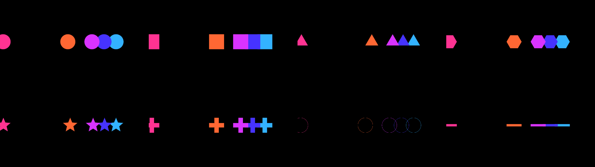
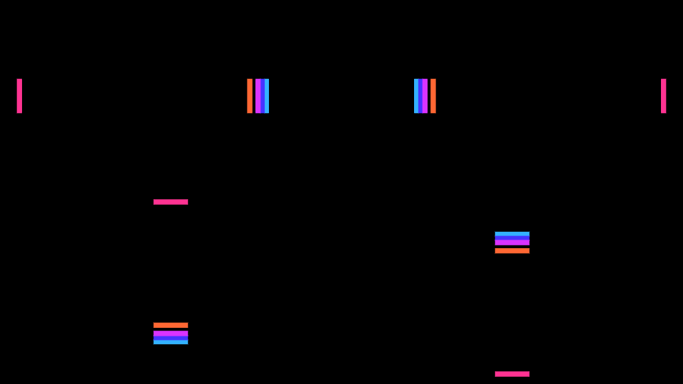

# Shunt

> **AI-assisted project.** This codebase was created with [Claude](https://claude.com/claude-code)
> (Anthropic), directed and reviewed by a human author. The queue is verified
> numerically by an offline harness that drives the real plugin class in a
> headless GL context: it renders frames and measures, in pixels, where every
> shape actually landed, how far apart the standing ones really are, how long
> one really stands still, and which of two overlapping shapes is really on top
> (see [Status](#status)). **Neither plugin has ever been loaded into Resolume.**
> They do load and render in an FFGL host — `oxbow`, on macOS — but that is not
> Arena. Check them in your own rig before trusting them in a show.

Shapes slide in from an edge, bank up a set distance apart, stand, and are
drawn away again — for [Resolume](https://resolume.com) Arena and Avenue, as a
pair of FFGL plugins. For animated masks, and for chroma animations driving a
pixel map.


<sub>Twelve discs from the left, overlapping by a third of their own thickness,
hue spread along the train — one arriving alone, three closing up, eight
standing. Rendered by `shtest`, the offline harness.</sub>

<!-- downloads:start -->

## Download

**[v0.1.0](https://github.com/stoatworks-labs/shunt/releases/tag/v0.1.0)** — prebuilt for macOS and Windows. Pick your platform:

<details>
<summary><b>macOS</b> — Universal (Apple Silicon + Intel)</summary>

| Build | Download | Size |
| --- | --- | --- |
| Universal (Apple Silicon + Intel) · .dmg disk image | [`shunt-0.1.0-macos-universal.dmg`](https://github.com/stoatworks-labs/shunt/releases/download/v0.1.0/shunt-0.1.0-macos-universal.dmg) | 624 KB |
| Universal (Apple Silicon + Intel) · .zip archive | [`shunt-macos-universal.zip`](https://github.com/stoatworks-labs/shunt/releases/latest/download/shunt-macos-universal.zip) | 337 KB |

</details>

<details>
<summary><b>Windows</b> — x64</summary>

| Build | Download | Size |
| --- | --- | --- |
| x64 · .exe installer | [`shunt-0.1.0-windows-x86_64-setup.exe`](https://github.com/stoatworks-labs/shunt/releases/download/v0.1.0/shunt-0.1.0-windows-x86_64-setup.exe) | 230 KB |
| x64 · .zip archive | [`shunt-windows-x86_64.zip`](https://github.com/stoatworks-labs/shunt/releases/latest/download/shunt-windows-x86_64.zip) | 232 KB |

</details>

All builds, checksums and release notes: [github.com/stoatworks-labs/shunt/releases](https://github.com/stoatworks-labs/shunt/releases).

The Windows builds are unsigned, so SmartScreen warns once.

<!-- downloads:end -->

## Where it came from

This is not an idea that arrived from inside the workshop. A Resolume operator
described it: pick a shape, pick an edge, and it slides in that far and stops
for a moment. The next one comes in behind it and stops a set distance back.
They bank up, overlapping, until the first one's wait is over and it carries on
off the far side — and then the next, and the next. *Like a caterpillar made of
shapes*, in their words.

Everything below is downstream of that description, including the two decisions
it did not settle: which of two overlapping shapes is on top, and what happens
when the queue is emptying from the front while it is still filling from the
back.

## Two plugins

| | |
|---|---|
| **SW Shunt** | A generator. The train over its own background. |
| **SW Shunt Mask** | An effect. The same train over — or cut into — the incoming clip. |

FFGL resolves one `plugMain` per binary, so a source and an effect are two
bundles rather than one bundle with two entries. Both ship together.

## Dwell is one dial, not two modes

The part that needed deciding was what happens when the queue is emptying from
the front while it is still filling from the back. It would have been easy to
ship that as two modes — *stack up, then release* and *keep moving* — and it
would have been wrong, because they are the same mechanism at two ends of one
slider:

| Dwell | What you see |
|---|---|
| **Low** | Shapes cross slowly. The head is still leaving as the fourth one arrives; the train never stands complete. |
| **High** | Shapes cross fast. The whole train is standing before the head moves at all, then it peels off one at a time. |

Everything in between is reachable, and **nothing in the code branches on it**.
The harness measures both ends: at Dwell 10% there is no phase at which the
whole train stands and there is always one shape leaving while another arrives;
at 90% it is the other way round.

## The gap, in both units

The spacing between standing shapes is offerable two ways, because neither
substitutes for the other:

- **Thickness** — a multiple of the shape's own extent *along the direction of
  travel*. At exactly 1 they stand edge to edge; below it the leading edge of
  each one overlaps the trailing edge of the one in front, which is what makes
  a caterpillar rather than a row. Change Size and the train still looks right.
- **Pixels** — an absolute count, measured along the direction of travel. This
  is the one for a pixel map: a 64-pixel gap measures **64.00 px at 1080p and
  64.00 px at 720p**, so it lands on a fixture pitch instead of near it.

## Newest on top

The shape that arrived most recently is drawn over the ones in front of it, so
a shape sliding in passes *over* the standing queue. The draw order rotates as
the phase advances, because which slot is newest turns over once per release —
a fixed order would look right for one frame in eight and wrong for the rest.

`Blend` **Max** is the exception, and deliberately: channel-wise maximum is
commutative, so under it there is no "on top" at all. That is the right trade
for a mask, where two overlapping white shapes should stay white, and the wrong
one for a caterpillar — which is why **Over** is the default.

## Why the procession never drifts

A shape's place is a **pure function of (slot, phase)**. There is no queue
object that shapes are pushed onto and popped off, no "has the one in front
left yet?" test, no previous frame. Nothing is integrated, so nothing
accumulates error and nothing slows down when the show gets heavy — which
matters when the output is driving a lighting rig rather than a screen.

What makes that possible is one choice: the slide speed is **derived**, not set.
Picking it as `(1 + 2·margin) / (1 − Dwell)` makes every shape's run exactly one
cycle long *whatever slot it stands at*, because a shape that stands near the
back has a short run in and a correspondingly long run out. So `Count` shapes
released one per `1/Count` of a cycle tile the cycle exactly: always that many
in play, never a hole in the procession, and never two shapes wanting one slot.

The same property is why beat sync costs nothing extra: phase is just a number,
so `Sync` swaps the host clock for the host's bar position and the whole train
locks to the track with no separate code path. Set it to `Manual` and the Phase
parameter becomes the only driver — hand it to Resolume's own BPM-synced
animation, a keyframe, or a MIDI fader.

## Shapes



Circle, Square, Triangle, Hexagon, Star, Cross, Ring, Bar — each with
**Stretch**, **Angle**, **Roundness**, **Outline**, **Softness** and **Shade**.
**Bar** is the "line" of the original request; stretch it and turn it a quarter
turn and it is a rung across the train.

**Angle is measured from the direction of travel**, not from the frame. A Bar at
0° is a dash pointing the way it is going and at 90° it is a rung — and changing
which edge the train comes in from does not make you re-dial it.

`Softness` at zero gives a hard edge, which is what you want for pixel mapping:
a feathered edge means a fixture sitting on the boundary reads a
half-brightness colour that was never in the design.

Note that the gap in **Thickness** units is measured on the shape as it is
actually drawn — so the same setting gives a tight train of bars and a wide one
of discs, which is the sheet above.

## Sides



**Left**, **Right**, **Top**, **Bottom**. `Travel` and a pixel `Gap` are both
measured along the direction of travel, so the numbers mean the same thing
whichever you pick. `Across` puts the run where you want it on the other axis,
and reaches past both edges so two instances can be layered.

## Mask modes

`SW Shunt Mask` adds four ways of combining the train with the clip:

| Mode | Result |
|---|---|
| **Over** | Shapes drawn on top, in their own colours. |
| **Reveal** | The clip shows **only** where the shapes are. |
| **Hide** | The clip shows **everywhere except** the shapes. |
| **Colourise** | The clip, tinted by the shape colour, inside the shapes. |

Colourise needs a **Colour Mode** other than White to do anything visible —
against a white shape colour it is arithmetically identical to Reveal.

## Build

```bash
git clone --recursive https://github.com/stoatworks-labs/shunt
cd shunt
cmake -B build -DCMAKE_BUILD_TYPE=Release
cmake --build build
cmake --install build      # straight into Resolume's plugin folder
```

Needs CMake 3.15+ and a C++17 compiler. The Resolume FFGL SDK comes in as a
submodule; on Windows, GLEW comes from vcpkg.

Both plugins are in every download — drop them into
`~/Documents/Resolume Arena/Extra Effects` (or the Avenue equivalent) and
restart Resolume.

## Status

**v0.1.0, and honestly early.** Everything below is measured by
`tools/verify.sh` on an Apple M4 Max, macOS 26.4.1 — a fresh universal Release
build, then real frames rendered and measured:

| Check | What it proves |
| --- | --- |
| `shtest --tile` | every shape's run is exactly one cycle long, and the runs tile the cycle: **92 slot runs across 9 configurations**, including a queue of 40 that overruns the frame and a gap of zero |
| `shtest --place` | **27 shapes** landed within **1.5 px** of an independent prediction, across 4 entry sides and 5 aspect ratios. Shapes that overlap or straddle an edge are skipped and counted, because a centroid cannot answer for them — `--gap` and `--order` cover those |
| `shtest --gap` | five bars set to a gap of one thickness render as **one run 48.9 px long against 5 × 9.72 predicted**; a 64 px gap measures **64.00 px at both 1080p and 720p, worst error 0.00 px**; a half-thickness gap merges into one run of 24.3 px against 24.3 predicted |
| `shtest --travel` | the head of the queue stops **1536.1 px** into a 1920 px frame where Travel 80% predicts 1536.0 — 8 configurations, all within 0.2 px |
| `shtest --dwell` | a standing shape stands for **23, 119 and 215 frames of 240** where Dwell 10%, 50% and 90% predict 24, 120 and 216. At 10% the train never stands complete and something is always leaving while something arrives; at 90% it is the other way round |
| `shtest --order` | the newer of two overlapping shapes is the one you see, measured by colour in the overlap at **13 overlaps across 5 phases** — after the draw order has rotated as well as before |
| `shtest --round` | circles stay round to **0.00%** and correctly sized to 0.01%, at 1:1, 16:9, portrait and 2.39:1 |
| `shtest --mask` | each of the 4 mask modes does what it says, measured inside a shape and outside it, against a clip captured rather than predicted |
| `shtest --clock` | the host's time unit is settled by measurement against a real clock, on three synthetic hosts — Resolume sends milliseconds, the harness sends seconds |
| `shtest --speed` | moving Speed ten minutes in does not teleport the train, and it runs at the new rate afterwards |
| `shtest --presets` | all 6 factory presets survive all 3 host behaviours, including a host that ignores value events |
| `tools/sweep.py` | all **33** parameters change the picture — no dead controls |
| `oxbow` | both bundles load in a real FFGL host, register with the right name, id and type, and render 120 frames with `gl error 0x0` |
| Universal binary | `lipo` reports `x86_64 arm64` on both, `plugMain` exported, ad-hoc signs |
| Render cost | **0.30 ms/frame at 720p, 0.35 at 1080p, 0.52 at 4K** |

What that does **not** cover, and it is the important half:

- **Neither plugin has ever been loaded into Resolume.** `oxbow` is an FFGL host
  and it is not Arena. How the seven parameter groups land in Resolume's
  inspector has not been looked at, and whether `Bar` sync locks against a real
  transport still needs a real transport.
- **No Windows build has been run anywhere.** CI cross-builds one; nothing has
  loaded it.
- **No OpenFX build.** The effect would port — the queue is plain C++ and the
  per-pixel work is eight distance functions — but it is not done, so there is
  nothing here for Resolve, Nuke or Vegas.
- The numbers above are one machine, one GPU. They say nothing about an NVIDIA
  or AMD driver.

## Diagnostics

A shader that will not compile looks, from the outside, exactly like a plugin
that does nothing. If that happens:

    ~/Library/Logs/shunt/shunt.YYYY-MM-DD.log

<!-- attributions:start -->
This project is built on other people's work — see [ATTRIBUTIONS.md](ATTRIBUTIONS.md).
<!-- attributions:end -->

## Licence

MIT — see [LICENSE](LICENSE).

The distance functions are the standard analytic forms derived and published by
[Inigo Quilez](https://iquilezles.org/articles/distfunctions2d/); the shape
primitives, their normalisation and the shading come from this fleet's
[orrery](https://github.com/stoatworks-labs/orrery), and everything else here
is ours.
