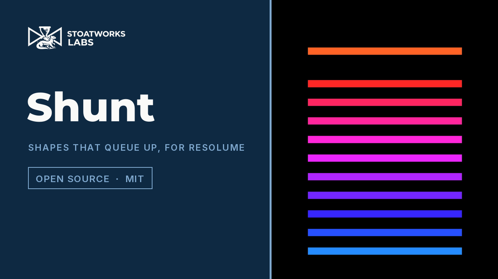

# Shunt

> **AI-assisted project.** This codebase was created with [Claude](https://claude.com/claude-code)
> (Anthropic), directed and reviewed by a human author. The queue is verified
> numerically by an offline harness that drives the real plugin class in a
> headless GL context: it renders frames and measures, in pixels, where every
> shape actually landed, how far apart the standing ones really are, how long
> one really stands still, and which of two overlapping shapes is really on top
> (see [Status](#status)). Both plugins load and run in **Resolume Arena
> 7.27.1**: the v0.2.0 Windows build was checked in a real Arena on
> 2026-09-23, before release — registration, all 50 controls the host reports on
> each plugin, a picture loaded into Image, and a rendered frame from each. That was on software rendering, and nothing here has been used in a
> show yet. Check it in your own rig before trusting it in one.

Shapes slide in from an edge, bank up a set distance apart, stand, and are
drawn away again — for [Resolume](https://resolume.com) Arena and Avenue, as a
pair of FFGL plugins. For animated masks, and for chroma animations driving a
pixel map.


<sub>Twelve discs from the left, overlapping by a third of their own thickness,
hue spread along the train — one arriving alone, three closing up, eight
standing. Rendered by `shtest`, the offline harness.</sub>

**[Try it in your browser](https://shunt-demo.stoatworks-labs.com/)** — both
plugins' own shaders in WebGL2 over a port of the queue, every control and all
seven presets, no install.

[](https://www.youtube.com/watch?v=m0wPwxjA5ls)

*[Watch it](https://www.youtube.com/watch?v=m0wPwxjA5ls) — 50 seconds: the
caterpillar forming, newest on top, Dwell swept from one end of the dial to the
other, a ladder whose 72-pixel gap was measured off the take at 72.00, the mask
cutting the train into a clip, and the close from the other edge. Every frame is
the real plugin's output: an FFGL plugin has no window, so the footage is
rendered by this repository's own harness (`shtest --pipe`, driven by a cue
sheet) rather than filmed off a screen. The clip is one of Resolume's own
bundled demos.*

<!-- downloads:start -->

## Download

**[v0.2.0](https://github.com/stoatworks-labs/shunt/releases/tag/v0.2.0)** — prebuilt for macOS and Windows. Pick your platform:

<details>
<summary><b>macOS</b> — Universal (Apple Silicon + Intel)</summary>

| Build | Download | Size |
| --- | --- | --- |
| Universal (Apple Silicon + Intel) · .dmg disk image | [`shunt-0.2.0-macos-universal.dmg`](https://github.com/stoatworks-labs/shunt/releases/download/v0.2.0/shunt-0.2.0-macos-universal.dmg) | 1.0 MB |
| Universal (Apple Silicon + Intel) · .zip archive | [`shunt-macos-universal.zip`](https://github.com/stoatworks-labs/shunt/releases/latest/download/shunt-macos-universal.zip) | 645 KB |

</details>

<details>
<summary><b>Windows</b> — x64</summary>

| Build | Download | Size |
| --- | --- | --- |
| x64 · .exe installer | [`shunt-0.2.0-windows-x86_64-setup.exe`](https://github.com/stoatworks-labs/shunt/releases/download/v0.2.0/shunt-0.2.0-windows-x86_64-setup.exe) | 296 KB |
| x64 · .zip archive | [`shunt-windows-x86_64.zip`](https://github.com/stoatworks-labs/shunt/releases/latest/download/shunt-windows-x86_64.zip) | 363 KB |

</details>

All builds, checksums and release notes: [github.com/stoatworks-labs/shunt/releases](https://github.com/stoatworks-labs/shunt/releases).

The Windows builds are unsigned, so SmartScreen warns once.

<!-- downloads:end -->

## Where it came from

This is not an idea that arrived from inside the workshop. A Resolume operator
described it: pick a shape, pick an edge, and it slides in that far and stops
for a moment. The next one comes in behind it and stops a set distance back.
They bank up, overlapping, until the first one's wait is over and it carries on
off the far side — and then the next, and the next. *Like a caterpillar made of
shapes*, in their words.

Everything below is downstream of that description, including the two decisions
it did not settle: which of two overlapping shapes is on top, and what happens
when the queue is emptying from the front while it is still filling from the
back.

## What 0.2.0 added, from the first night in a real rig

The operator who asked for it had it running within hours of 0.1.0 and sent
back six notes. All six are in 0.2.0:

| They said | What it is now |
| --- | --- |
| *"Mask Mode in Output doesn't seem to do anything"* | It didn't — in the **source**. 0.1.0 declared Mask Mode and Mix on both plugins and ignored both in `SW Shunt`. Now the source's Mask Mode is **Over / Matte / Inverse Matte**, and Mix fades its whole output. [Output](#output) |
| *"invert colours so I can use the moving shapes as masks"* | **Matte** is white shapes on opaque black, **Inverse Matte** black on white — for another layer to key against. |
| *"change the Y value for each set of objects so that the next set doesn't overlap the previous"* | **Lanes**: Step moves each new set a set distance across, rolling over from one edge to the other; Random puts it on a random lane never closer than one shape to the last. [Lanes](#lanes) |
| *"Drop shadows ;o)"* | **Shadow**, **Shadow Distance**, **Shadow Blur**, falling away from the Light. [Shadows](#shadows) |
| *"load an image … a folder of images … a sprite sheet"* | **Image**, with **Image From** Single / Folder / Sprite Sheet and **Pick** Same / Random / In Order. [Pictures on the shapes](#pictures-on-the-shapes) |
| *"Ring with 0.9 outline and 0.56 roundness makes a weird thing that I like"* | That look is now the **Bullseye** preset. |

Nothing old moved: every control 0.1.0 had keeps its id, the new ones are
declared after them, and each new one defaults to off — a 0.1.0 composition
opens looking as it did. One thing does look different: **the shading's light is
now fixed on the screen**. In 0.1.0 it turned with each shape, so a train coming
in from the top was lit from the side; with a drop shadow cast from the same
Light control, that would have been visible at once.

## Two plugins

| | |
|---|---|
| **SW Shunt** | A generator. The train over its own background. |
| **SW Shunt Mask** | An effect. The same train over — or cut into — the incoming clip. |

FFGL resolves one `plugMain` per binary, so a source and an effect are two
bundles rather than one bundle with two entries. Both ship together.

## Dwell is one dial, not two modes

The part that needed deciding was what happens when the queue is emptying from
the front while it is still filling from the back. It would have been easy to
ship that as two modes — *stack up, then release* and *keep moving* — and it
would have been wrong, because they are the same mechanism at two ends of one
slider:

| Dwell | What you see |
|---|---|
| **Low** | Shapes cross slowly. The head is still leaving as the fourth one arrives; the train never stands complete. |
| **High** | Shapes cross fast. The whole train is standing before the head moves at all, then it peels off one at a time. |

Everything in between is reachable, and **nothing in the code branches on it**.
The harness measures both ends: at Dwell 10% there is no phase at which the
whole train stands and there is always one shape leaving while another arrives;
at 90% it is the other way round.

## The gap, in both units

The spacing between standing shapes is offerable two ways, because neither
substitutes for the other:

- **Thickness** — a multiple of the shape's own extent *along the direction of
  travel*. At exactly 1 they stand edge to edge; below it the leading edge of
  each one overlaps the trailing edge of the one in front, which is what makes
  a caterpillar rather than a row. Change Size and the train still looks right.
- **Pixels** — an absolute count, measured along the direction of travel. This
  is the one for a pixel map: a 64-pixel gap measures **64.00 px at 1080p and
  64.00 px at 720p**, so it lands on a fixture pitch instead of near it.

## Newest on top

The shape that arrived most recently is drawn over the ones in front of it, so
a shape sliding in passes *over* the standing queue. The draw order rotates as
the phase advances, because which slot is newest turns over once per release —
a fixed order would look right for one frame in eight and wrong for the rest.

`Blend` **Max** is the exception, and deliberately: channel-wise maximum is
commutative, so under it there is no "on top" at all. That is the right trade
for a mask, where two overlapping white shapes should stay white, and the wrong
one for a caterpillar — which is why **Over** is the default.

## Why the procession never drifts

A shape's place is a **pure function of (slot, phase)**. There is no queue
object that shapes are pushed onto and popped off, no "has the one in front
left yet?" test, no previous frame. Nothing is integrated, so nothing
accumulates error and nothing slows down when the show gets heavy — which
matters when the output is driving a lighting rig rather than a screen.

What makes that possible is one choice: the slide speed is **derived**, not set.
Picking it as `(1 + 2·margin) / (1 − Dwell)` makes every shape's run exactly one
cycle long *whatever slot it stands at*, because a shape that stands near the
back has a short run in and a correspondingly long run out. So `Count` shapes
released one per `1/Count` of a cycle tile the cycle exactly: always that many
in play, never a hole in the procession, and never two shapes wanting one slot.

The same property is why beat sync costs nothing extra: phase is just a number,
so `Sync` swaps the host clock for the host's bar position and the whole train
locks to the track with no separate code path. Set it to `Manual` and the Phase
parameter becomes the only driver — hand it to Resolume's own BPM-synced
animation, a keyframe, or a MIDI fader.

## Shapes


Circle, Square, Triangle, Hexagon, Star, Cross, Ring, Bar — each with
**Stretch**, **Angle**, **Roundness**, **Outline**, **Softness** and **Shade**.
**Bar** is the "line" of the original request; stretch it and turn it a quarter
turn and it is a rung across the train.

**Angle is measured from the direction of travel**, not from the frame. A Bar at
0° is a dash pointing the way it is going and at 90° it is a rung — and changing
which edge the train comes in from does not make you re-dial it.

`Softness` at zero gives a hard edge, which is what you want for pixel mapping:
a feathered edge means a fixture sitting on the boundary reads a
half-brightness colour that was never in the design.

Note that the gap in **Thickness** units is measured on the shape as it is
actually drawn — so the same setting gives a tight train of bars and a wide one
of discs, which is the sheet above.

## Sides


**Left**, **Right**, **Top**, **Bottom**. `Travel` and a pixel `Gap` are both
measured along the direction of travel, so the numbers mean the same thing
whichever you pick. `Across` puts the run where you want it on the other axis,
and reaches past both edges so two instances can be layered.

## Output

### In `SW Shunt Mask`: four mask modes

`SW Shunt Mask` has four ways of combining the train with the clip:

| Mode | Result |
|---|---|
| **Over** | Shapes drawn on top, in their own colours. |
| **Reveal** | The clip shows **only** where the shapes are. |
| **Hide** | The clip shows **everywhere except** the shapes. |
| **Colourise** | The clip, tinted by the shape colour, inside the shapes. |

Colourise needs a **Colour Mode** other than White to do anything visible —
against a white shape colour it is arithmetically identical to Reveal.

**Mix** fades the effect against the untouched clip.

### In `SW Shunt`: a matte

The source has no clip to mask, so the same **Mask Mode** control draws a matte
for another layer to key against:

| Mode | Result |
| --- | --- |
| **Over** | The train in its own colours, over the Background. |
| **Matte** | White shapes on opaque black — whatever the colour, shading, Blend or shadow say. |
| **Inverse Matte** | Black shapes on opaque white. |

Coverage, opacity, Softness and a picture's alpha all still apply, so a soft edge
is a soft edge in the matte too. **Mix** fades the source's whole output to
transparent — as one picture, through the blend's constant factor, so overlapping
shapes fade exactly as much as the background behind them.

The element values line up with the effect's — Reveal is Matte, Hide is Inverse
Matte — so a composition moved from one plugin to the other lands on the
corresponding mode.

## Lanes

A **set** is one cycle's worth of shapes — `Count` of them. With **Lanes** off,
every set runs along `Across`, and at settings where the next set arrives while
the last is still standing, the two run straight through each other.

| Lanes | Each new set |
| --- | --- |
| **Off** | on `Across`, as in 0.1.0 |
| **Step** | `Lane Step` further across than the last — −50% to +50% of the frame — rolling over from one edge to the other |
| **Random** | on a random lane, never closer to the last set than one shape's own width |

Both wrap inside the band where a whole shape stays on the frame, so rolling
over puts the shape fully back on rather than half off the far edge.

There is still no state. A shape's set is `floor( phase − slot / Count )`, and
its lane is a function of that number — Random included: each set moves half
the band plus a jitter of at most `½ − s` either way, where `s` is the shape's
width as a share of the band, so two consecutive sets are always between `s`
and `1 − s` apart round the wrap. A random walk would have been a running sum,
which is state. A set changes lane only at the instant its shape is released
from off-stage, where nobody can see it.

## Shadows


**Shadow** is the opacity, **Shadow Distance** the offset in multiples of the
shape's radius, **Shadow Blur** the feather. They fall away from the **Light**
control in the Shading group — the same light the shading uses, so the
highlight and the shadow agree.

Each shadow is drawn in the same instanced draw as its shape, immediately
before it — two instances per shape — so a shadow falls on the older shapes the
new one has slid over and never on its own shape. Drawing all the shadows first
would put every shadow under every shape, and the overlap this plugin is about
would lose its depth.

No shadows in **Hide**, whose blend would punch them out of the clip as a
second, offset set of holes, and none in a **matte**.

## Pictures on the shapes


**Image** is a file. **Image From** says what to do with it:

| Image From | |
| --- | --- |
| **Single** | the whole picture on every shape |
| **Folder** | every image in the chosen file's folder — sorted by name, up to 36 — one per shape |
| **Sprite Sheet** | the picture cut into **Columns** × **Rows** |

**Pick** says which each shape gets: **Same** (the one **Sprite** names — it
wraps past the end), **Random** (its own, chosen when it is released) or **In
Order** (the next along from the shape before, starting at Sprite). A shape
keeps its picture for its whole run. **Image Mix** blends the picture against
the shape's own colour; the colour tints the picture, so White leaves it as it
is.

Each picture is cropped to its largest centred square, because a shape is drawn
over a square: a 16:9 photo on a circle is a circle of the middle of the photo,
not an ellipse of all of it. The picture turns with **Angle** and not with the
entry side, so it stays upright whichever edge the train comes in from.

Columns, Rows and Sprite are integer controls you can type a number into — a
sprite sheet is somebody else's grid, and a slider that lands either side of 5
is no way to read one.

## Build

```bash
git clone --recursive https://github.com/stoatworks-labs/shunt
cd shunt
cmake -B build -DCMAKE_BUILD_TYPE=Release
cmake --build build
cmake --install build      # straight into Resolume's plugin folder
```

Needs CMake 3.15+ and a C++17 compiler. The Resolume FFGL SDK comes in as a
submodule; on Windows, GLEW comes from vcpkg.

Both plugins are in every download — drop them into
`~/Documents/Resolume Arena/Extra Effects` (or the Avenue equivalent) and
restart Resolume.

## Status

**v0.2.0, and honestly early.** Everything in the first table is measured by
`tools/verify.sh` on an Apple M4 Max, macOS 26.4.1 — a fresh universal Release
build, then real frames rendered and measured:

| Check | What it proves |
| --- | --- |
| `shtest --tile` | every shape's run is exactly one cycle long, and the runs tile the cycle: **92 slot runs across 9 configurations**, including a queue of 40 that overruns the frame and a gap of zero |
| `shtest --place` | **27 shapes** landed within **1.5 px** of an independent prediction, across 4 entry sides and 5 aspect ratios. Shapes that overlap or straddle an edge are skipped and counted, because a centroid cannot answer for them — `--gap` and `--order` cover those |
| `shtest --gap` | five bars set to a gap of one thickness render as **one run 48.9 px long against 5 × 9.72 predicted**; a 64 px gap measures **64.00 px at both 1080p and 720p, worst error 0.00 px**; a half-thickness gap merges into one run of 24.3 px against 24.3 predicted |
| `shtest --travel` | the head of the queue stops **1536.1 px** into a 1920 px frame where Travel 80% predicts 1536.0 — 8 configurations, all within 0.2 px |
| `shtest --dwell` | a standing shape stands for **23, 119 and 215 frames of 240** where Dwell 10%, 50% and 90% predict 24, 120 and 216. At 10% the train never stands complete and something is always leaving while something arrives; at 90% it is the other way round |
| `shtest --order` | the newer of two overlapping shapes is the one you see, measured by colour in the overlap at **13 overlaps across 5 phases** — after the draw order has rotated as well as before |
| `shtest --round` | circles stay round to **0.00%** and correctly sized to 0.01%, at 1:1, 16:9, portrait and 2.39:1 |
| `shtest --mask` | each of the 4 mask modes does what it says, measured inside a shape and outside it, against a clip captured rather than predicted |
| `shtest --matte` | the source's Over, Matte and Inverse Matte on the picture, with the shape red, shaded, shadowed and Added and the background half-transparent grey — a matte throws all of it away. Mix 0.5 halves the whole composite, shape and background alike |
| `shtest --lanes` | every shape of a set on one lane at every phase, in both modes and on both axes; Step exactly one step per set for 440 sets, wrapping inside the frame; Random never closer than one shape between consecutive sets over **5,500 sets** at four sizes, using the whole band; lanes change nothing along the track; **20 shapes** on Random lanes rendered within 1.5 px of the solver |
| `shtest --shadow` | the shadow falls away from the light at three angles and lies under its own shape; Shadow 0 is **pixel-identical** to the picture before shadows existed; Hide draws none |
| `shtest --image` | a quadrant image upright from the left, top and right, and a quarter turn at Angle 0.25; each cell of a 4×1 sheet clean to its edge (no bleed from the next cell), and Sprite wrapping; Random and In Order across **48 shapes and 12 sets** using every cell, each shape keeping its own; a folder of three images and a text file read as three, by name; no file, a text file and a missing path all draw the plain shape |
| `shtest --clock` | the host's time unit is settled by measurement against a real clock, on three synthetic hosts — Resolume sends milliseconds, the harness sends seconds |
| `shtest --speed` | moving Speed ten minutes in does not teleport the train, and it runs at the new rate afterwards |
| `shtest --presets` | all 7 factory presets survive all 3 host behaviours, including a host that ignores value events |
| `tools/sweep.py` | all **47** parameters change the picture — Mix and Mask Mode on **both** plugins, every Image control against an image the sweep writes itself. No dead controls |
| `oxbow` | both bundles load in a real FFGL host, register with the right name, id and type, and render 120 frames with `gl error 0x0` |
| Universal binary | `lipo` reports `x86_64 arm64` on both, `plugMain` exported, ad-hoc signs |
| Render cost | **0.2–0.4 ms/frame at 720p and 1080p, 0.3–0.5 at 4K** — the same as 0.1.0 within run-to-run noise |

And in Resolume itself. **v0.2.0**, 2026-09-23: the Windows build from this
release's own workflow — the DLLs, not a local build — went through the same
Arena gate on win-lab before the tag was cut. **17 passed, 0 failed, 0 skipped**:
both DLLs load and register; all **50** controls on each plugin match the
declarations, including the twelve new ones (Columns, Rows and Sprite as real
integer ranges); the Image control loaded a sprite sheet from a Windows path on
both plugins; both render; clean log, one Arena process throughout. 24 of the
source's controls and 21 of the mask's were shown to move the picture in Arena,
11 of them each under a precondition, and the rest were inconclusive against the
animation's own motion — none dead.

**v0.1.0**, 2026-09-22 — the record that release shipped with. The **shipped v0.1.0 Windows build** — the
DLLs from the release page, not a local build — was loaded into Resolume Arena
7.27.1 (build 15990) on win-lab, an x64 Windows 11 VM, by the fleet's Arena
release gate. 15 checks, all passed:

| Check | Result |
| --- | --- |
| Load and register | both DLLs load; `SW Shunt` registers as a **source**, `SH01`, and `SW Shunt Mask` as an **effect**, `SH02` |
| Control surface | all **38** controls on each plugin match what the plugin declares — name, order, type, 0..1 range and default. Resolume hoists the mask's `Opacity` to the top of its list — Orrery Mask shows the same |
| Name truncation | four names sit at exactly the 16-character FFGL limit — `Background_Green`, `Background Alpha`, `Source on GitHub`, `Support the work` — and all four arrive complete |
| Render | both plugins produce a frame with content |
| Controls | none dead. **13** of the source's controls and **10** of the mask's were shown to move the picture in Arena; the rest were *inconclusive*, not dead — the train never stops moving at the default Speed, and a subtle control's effect cannot be separated from that motion at the gate's 320×240. `tools/sweep.py` shows all 33 live offline |
| Clean | no shader or error lines in Arena's log for the run, and Arena survived it on one process |

What that does **not** cover, and it is the important half:

- **0.2.0's new controls have been through the gate, not through a person.**
  The gate proves they are there, typed and ranged as declared, and that the
  Image loads a real file on Windows; it cannot say how Resolume's file picker
  or the integer spinners feel in the inspector.

- **The Arena run was on software rendering.** win-lab has no GPU — Arena runs on
  Mesa llvmpipe there — so it says nothing about an NVIDIA or AMD driver, and
  nothing about speed.
- **It has not been used in a show, or on macOS in Arena.** How the seven
  parameter groups read in the inspector has not been reviewed by a person, and
  whether `Bar` sync locks against a real transport still needs a real
  transport.
- **No OpenFX build.** The effect would port — the queue is plain C++ and the
  per-pixel work is eight distance functions — but it is not done, so there is
  nothing here for Resolve, Nuke or Vegas.
- The measured numbers are one Mac and one GPU.

## Diagnostics

A shader that will not compile looks, from the outside, exactly like a plugin
that does nothing — and so does an Image that would not load. If that happens,
the log says which file, and why:

    ~/Library/Logs/shunt/shunt.YYYY-MM-DD.log

<!-- attributions:start -->
This project is built on other people's work — see [ATTRIBUTIONS.md](ATTRIBUTIONS.md).
<!-- attributions:end -->

## Licence

MIT — see [LICENSE](LICENSE).

The distance functions are the standard analytic forms derived and published by
[Inigo Quilez](https://iquilezles.org/articles/distfunctions2d/); the shape
primitives, their normalisation and the shading come from this fleet's
[orrery](https://github.com/stoatworks-labs/orrery), and everything else here
is ours.
