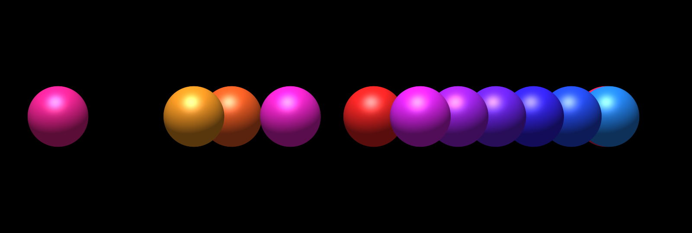
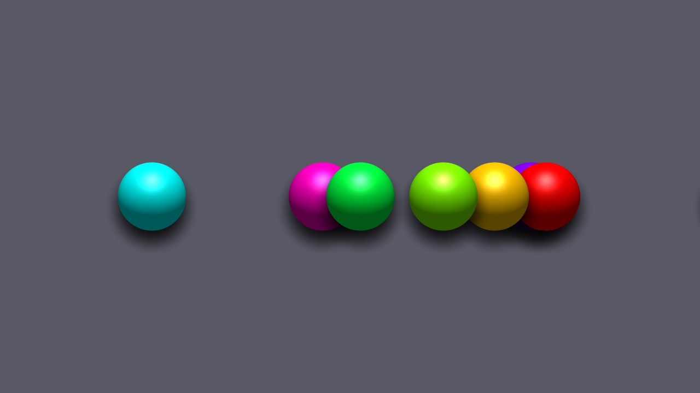
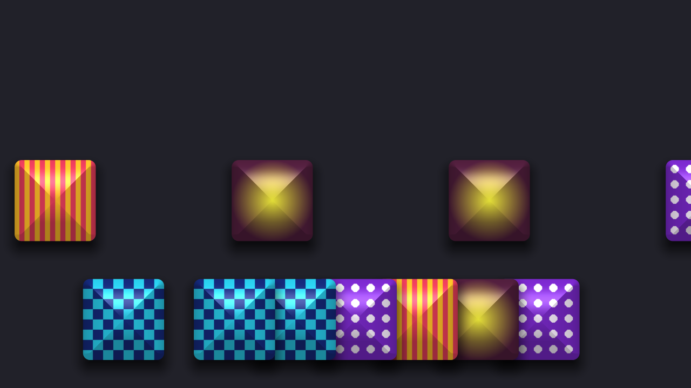

# Shunt user guide

Shunt makes **a queue of shapes**: they slide in from an edge you choose, stop a
set distance in, bank up behind one another, and are drawn away off the far
side. It is two FFGL plugins for [Resolume](https://resolume.com) Arena and
Avenue — for animated masks, and for chroma animations driving a pixel map.

*Twelve discs from the left, overlapping by a third of their own thickness — one
arriving alone, three closing up, eight standing.*

> **Before you rely on this:** released at **v0.2.0**, and honestly early. Every
> geometric claim below is measured on rendered frames rather than asserted —
> where each shape landed, to 1.5 px; how far apart the standing ones are, to a
> pixel; how long one stands, in frames; which of two overlapping shapes is on
> top. **Both plugins load and run in Resolume Arena 7.27.1**: the shipped
> v0.1.0 Windows build was checked in a real Arena, where both register
> correctly, every control matches what the plugin declares, and both render.
> That run was on software rendering, so it says nothing about a GPU. The
> controls 0.2.0 added — Lanes, Shadow, Image, and the source's Mask Mode — are
> checked by the offline harness but have not yet been driven by a person in
> Arena. **Try it on a spare layer first**, and please report anything that
> misbehaves.
>
> This codebase was created with AI assistance, directed and reviewed by a human
> author.

---

## Installing

Both plugins are in every download. Drop them into
`~/Documents/Resolume Arena/Extra Effects` (or the Avenue equivalent) and
restart Resolume.

| | |
|---|---|
| **SW Shunt** | A generator. The train over its own background. |
| **SW Shunt Mask** | An effect. The same train over — or cut into — the incoming clip. |

---

## Start here

Drop **SW Shunt** on an empty layer and it is already doing the thing: eight
discs from the left, each overlapping the one in front by a quarter, banking up
at 78% of the way across.

The **Preset** dropdown near the bottom is the fastest way to see the range.
Seven looks, all built out of the same controls:

| Preset | What it is |
|---|---|
| **Caterpillar** | The defaults, named. Discs from the left, overlapping, standing about half of each cycle. |
| **Conveyor** | Separated rounded blocks on a steady belt. Short stand, so it never fully stacks. |
| **Stacking Up** | The other end of the dial — the whole train stands before the head moves, then peels off. |
| **Ladder Fall** | Rungs falling down the frame and piling at the bottom. |
| **Ticker** | A dense hue-cycling stream of thin dashes from the right, barely stopping. |
| **Shingle** | Big shaded discs sliding over one another as they bank up. |
| **Bullseye** | Green targets — a thick Ring whose Outline strokes both its edges, leaving a ring and a dot. Found by an operator on the first night. |

Editing any slider a preset covers drops the dropdown back to **Custom**. That
is not you losing the preset — the sliders are still where it put them.

---

## The Queue group

This is the plugin.

**From** — which edge the train comes in from: Left, Right, Top or Bottom. It
travels away from that edge, and everything below is measured along that
direction, so the numbers mean the same thing whichever you pick.

**Count** — how many shapes are in the train, 1 to 64. One is released every
`1/Count` of a cycle.

**Travel** — how far in the **head** of the queue stops, as a percentage of the
frame along the direction of travel. Everything else stands one Gap further back
than the shape in front of it. At 100% the head stops at the far edge.

**Gap Units** and **Gap** — the spacing between standing shapes, centre to
centre. The dropdown decides what the slider is counting:

- **Thickness** — multiples of the shape's own extent *along the direction of
  travel*, 0 to 4. At exactly **1.0** consecutive shapes stand edge to edge.
  Below that they overlap — the leading edge of each one covering the trailing
  edge of the one in front — which is what makes a caterpillar rather than a
  row. Change **Size** and the train still looks the same, because the gap is
  measured on the shape.
- **Pixels** — an absolute count, 0 to 512, measured along the direction of
  travel. Use this when the output is feeding a pixel map and the spacing has to
  land on the fixture pitch: 64 pixels is 64 pixels, whatever the resolution.

**Dwell** — how much of each shape's own cycle it spends standing still. This is
the single most important control and it is worth understanding what it does to
the *rest* of the effect, because it also sets how fast shapes slide:

| Dwell | What happens |
|---|---|
| **Low** (0–25%) | Shapes cross slowly and barely stop. The head is still leaving as the fourth one arrives — the queue empties from the front while it is still filling from the back. |
| **Middle** (~50%) | The classic caterpillar: a group standing, one or two arriving, one or two leaving. |
| **High** (75–95%) | Shapes cross fast. The whole train is standing before the head moves at all, then it peels off one at a time. |

There is no mode switch here, and that is deliberate — it is one continuous
range and everything in between is reachable.

### How long is the dwell in milliseconds?

Dwell is a fraction of a shape's cycle rather than a time, so that it means the
same thing whether the plugin is free-running, locked to the beat, or being
driven by hand. To get a time, divide by **Speed**:

    seconds standing  =  Dwell ÷ Speed

| Speed | Dwell 25% | Dwell 50% | Dwell 75% |
|---|---|---|---|
| 0.5 /s | 500 ms | 1.0 s | 1.5 s |
| 1.0 /s | 250 ms | **500 ms** | 750 ms |
| 2.0 /s | 125 ms | 250 ms | 375 ms |

**Across** — where the run sits on the other axis. It reaches a little past both
edges, so the train can sit partly off-frame and be layered with a second
instance on another layer.

---

## Timing

**Sync** decides where the phase comes from:

| Mode | Speed means |
|---|---|
| **Free** | cycles per second |
| **Beat** | cycles per beat |
| **Bar** | cycles per bar |
| **Manual** | nothing — **Phase** is the only driver |

A cycle is one shape's whole run: in, stand, out. With `Count` shapes that is
`Count` arrivals, so at Speed 0.2 /s and 8 shapes one arrives every 0.6 seconds.

**Manual** is the mode to reach for when you want Resolume's own BPM-synced
animation, a keyframe or a MIDI fader driving the procession. Assign that to
**Phase** and nothing underneath fights it.

Moving **Speed** does not jump the train — the phase already reached is carried
forward and counted on from there — so you can change pace mid-show without
everything teleporting. Beat and Bar deliberately *do* re-lock, because that is
what they are for.

---

## Shape

Eight primitives: Circle, Square, Triangle, Hexagon, Star, Cross, Ring, Bar.
**Bar** is the "line" — stretch it and turn it a quarter turn and it is a rung
across the train.

**Angle is measured from the direction of travel**, not from the frame. A Bar at
0° points the way it is going; at 90° it is a rung. Change **From** and it stays
a rung — you do not have to re-dial it.

**Size** is a radius as a fraction of the *short* edge, which is what keeps a
circle round on a 16:9 output. Note that it also moves the Gap when Gap Units is
Thickness, because a thickness is measured on the shape itself.

**Stretch** widens the shape along its own x, exactly 1.0 at the centre of the
slider. **Roundness** rounds corners — on **Ring** it sets the ring's weight
instead, because a circle has no corners to round. **Outline** strokes the shape
instead of filling it. **Softness** feathers the edge.

**Softness at zero is a hard edge, and that is what you want for pixel
mapping**: a feathered edge means a fixture sitting on the boundary reads a
half-brightness colour that was never in the design.

---

## Colour and Shading

**Colour Mode** is White, Solid, Hue Spread or Hue Cycle. The hue modes take
saturation and brightness off the swatch and replace only the hue, and the hue
is keyed to a shape's **place in the train** — so a hue spread reads as a stable
pattern marching through rather than the whole set flickering each time the
queue turns over.

**Blend** decides what overlaps do:

| Blend | Overlaps |
|---|---|
| **Over** | The newer shape covers the older one. This is the caterpillar. |
| **Add** | Overlaps brighten. |
| **Max** | Channel-wise maximum — two overlapping white shapes stay white. |

**Max is what a mask usually wants**, but be aware it throws the layering away:
maximum does not care which shape came first, so under Max there is no "newer on
top" at all. Over is the default for that reason.

**Shade** lights each shape as though it had been inflated, with **Light**
setting where the light comes from — a full turn over the slider, 25% straight
down from the top of the frame. It is off by default, and it earns its place
here more than you might expect: a train of shaded shapes sliding over one
another is what makes the overlap read as depth rather than as two flat shapes
stacked.

The light is fixed **on the screen**: turn a shape with Angle, or bring the
train in from a different edge, and the highlight stays where Light put it.
(Before 0.2.0 it turned with the shape.)

---

## Shadow

| Control | |
|---|---|
| **Shadow** | How dark. 0 is off, and exactly the picture without shadows. |
| **Shadow Distance** | How far the shadow is thrown, in multiples of the shape's own radius. |
| **Shadow Blur** | How soft its edge is, in the same units. |

The shadow falls **away from Light**, so shading and shadow agree. Each shape's
shadow lands on the shapes it has slid over — never on the shape itself — so
the newest shape on top looks like it is on top.

Shadows are black, so on the default black background you only see them where
they fall on other shapes: give the **Background** some colour to see the whole
thing. They are not drawn in **Hide**, or in a **Matte** (below), and under
**Blend** Add or Max they have nothing to darken and disappear.

---

## Lanes

A **set** is one cycle's worth of shapes — **Count** of them, arriving one
after another. Normally every set runs along the same line (**Across**), so at
settings where the next set arrives while the last is still standing or
leaving, the two run straight through each other. **Lanes** moves each new set
somewhere else:

| Lanes | Each new set |
|---|---|
| **Off** | On Across, every time. |
| **Step** | **Lane Step** further across than the one before — up to half the frame either way, 0 in the middle of the slider — rolling over from one edge to the other. |
| **Random** | On a random lane, never closer to the last set than one shape's own width. |

Both keep every shape fully on the frame when they roll over. A set only ever
changes lane off-stage, as its first shape is released, so nothing jumps
sideways in view. Across still sets where the sequence starts.

With a big shape the band is narrow: once a shape is more than a third of the
frame across, Random has little room and alternates between two sides.

---

## Pictures on the shapes

Choose a file in **Image** and it appears inside every shape. **Image From**
says what the file means:

| Image From | |
|---|---|
| **Single** | The picture, on every shape. |
| **Folder** | Every image in the same folder as the file you chose — sorted by name, up to 36 — one per shape. |
| **Sprite Sheet** | The picture cut into **Columns** × **Rows**, one cell per shape. |

**Pick** chooses which each shape gets:

| Pick | |
|---|---|
| **Same** | Every shape shows the one **Sprite** names — 0 is the first; it wraps round past the end. |
| **Random** | Each shape its own, chosen as it is released. |
| **In Order** | Each shape the next along from the one before, starting at Sprite. |

A shape keeps its picture for its whole run. **Image Mix** blends between the
shape's own colour (0) and the picture (1); the Colour tints the picture, so
White leaves it untouched and Solid red makes it red.

A few things worth knowing:

- **Each picture is cropped to a centred square**, because a shape is drawn over
  a square. A wide photo on a circle shows the middle of the photo.
- **It stays upright whichever edge the train comes in from**, and turns with
  **Angle**.
- **Sprite sheets are read exactly.** Columns and Rows are whole numbers you can
  type in; if the picture does not divide exactly the log says so, because that
  is the usual reason a sprite shows a sliver of its neighbour.
- **Transparent parts of a picture are transparent in the shape**, and cast no
  shadow.
- A folder of large photos takes a moment to load — the frame is late once, when
  you choose the file, not every frame after.
- PNG, JPEG, GIF (first frame), BMP, TGA and PSD. Up to 8192 pixels on a side.

---

## Masking a clip

**SW Shunt Mask** takes the incoming clip and adds a **Mask Mode**:

| Mode | Result |
|---|---|
| **Over** | Shapes drawn on top, in their own colours. |
| **Reveal** | The clip shows **only** where the shapes are. |
| **Hide** | The clip shows **everywhere except** the shapes. |
| **Colourise** | The clip, tinted by the shape colour, inside the shapes. |

Colourise needs a **Colour Mode** other than White to do anything you can see —
against a white shape colour it is arithmetically the same as Reveal.

**Mix** fades the shape layer. On Reveal and Colourise the untouched clip fades
back in as the effect fades out, so Mix at 0 is the clip as it arrived.

---

## A matte from SW Shunt

**SW Shunt** has no clip to mask, so its **Mask Mode** makes a matte instead —
for another layer's mask, or a luma key:

| Mode | Result |
|---|---|
| **Over** | The train in its own colours, over the Background. |
| **Matte** | White shapes on solid black. |
| **Inverse Matte** | Black shapes on solid white. |

A matte ignores colour, shading, shadows and Blend — it is a matte, and a grey
fringe would be a partial key nobody asked for — but keeps Softness, Opacity and
a picture's transparency, so a soft edge is a soft edge in the key too.

**Mix** on SW Shunt fades its whole output, background and all, to transparent.

(Before 0.2.0 these two controls sat in SW Shunt's Output group and did
nothing. They were reported as broken on the first night, fairly.)

---

## Using it for a pixel map

The composition *is* the fixture layout, Resolume's pixel mapper samples it, and
the shapes are what the lights do. Three things matter:

1. **Set Gap Units to Pixels** and dial the fixture pitch. It is exact — a
   64-pixel gap measures 64 pixels at any output resolution.
2. **Softness to zero.** A feathered edge puts a colour on a boundary fixture
   that is in nobody's design.
3. **Use Sync**, so the procession is locked to the track rather than
   free-running against it.

`Across` and a second instance on a second layer gives you parallel runs.

---

## If it looks like it is doing nothing

A shader that will not compile presents exactly as a plugin that does nothing,
with the real message in the log:

    ~/Library/Logs/shunt/shunt.YYYY-MM-DD.log

Otherwise, the usual suspects: **Speed** dragged to the very bottom is a
deliberate dead zone that means *stopped*; **Opacity** or **Mix** at zero; and
on **SW Shunt Mask**, **Mask Mode** set to Hide with Travel somewhere the shapes
are off-frame.

An **Image** that would not load leaves the shapes plain, and the log says
which file and why — a path that has moved, a file that is not a picture, or
one bigger than 8192 pixels.

---

## Reporting something

[github.com/stoatworks-labs/shunt/issues](https://github.com/stoatworks-labs/shunt/issues).
A screenshot and the composition's resolution is usually enough. This plugin
exists because somebody wrote in with an idea, so the door is open.
